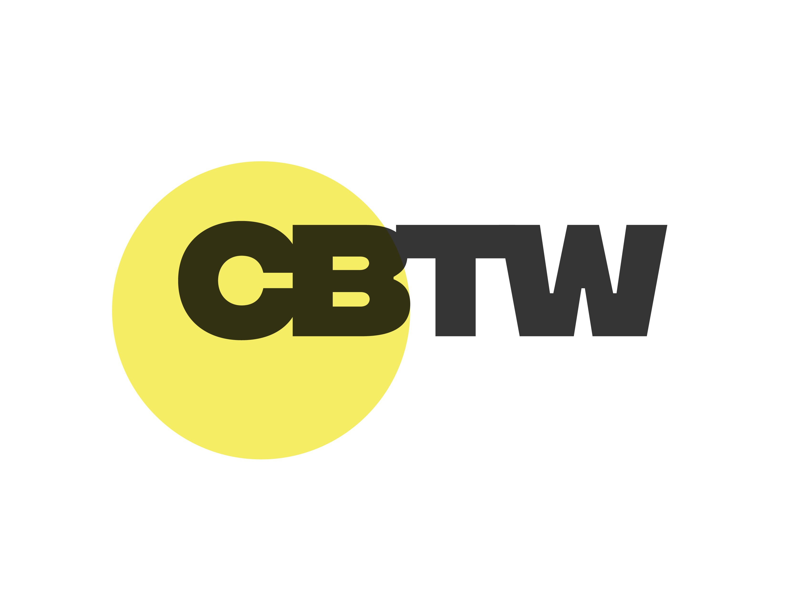

<!-- Improved compatibility of back to top link: See: https://github.com/othneildrew/Best-README-Template/pull/73 -->
<a id="readme-top"></a>
<!--
*** Thanks for checking out the Best-README-Template. If you have a suggestion
*** that would make this better, please fork the repo and create a pull request
*** or simply open an issue with the tag "enhancement".
*** Don't forget to give the project a star!
*** Thanks again! Now go create something AMAZING! :D
-->


<!-- PROJECT SHIELDS -->
<!--
*** I'm using markdown "reference style" links for readability.
*** Reference links are enclosed in brackets [ ] instead of parentheses ( ).
*** See the bottom of this document for the declaration of the reference variables
*** for contributors-url, forks-url, etc. This is an optional, concise syntax you may use.
*** https://www.markdownguide.org/basic-syntax/#reference-style-links
-->
[![Contributors][contributors-shield]][contributors-url]
[![Forks][forks-shield]][forks-url]
[![Stargazers][stars-shield]][stars-url]
[![Issues][issues-shield]][issues-url]
[![MIT License][license-shield]][license-url]
[![LinkedIn][linkedin-shield]][linkedin-url]


<!-- PROJECT LOGO -->
<br />
<div align="center">
  <a href="https://github.com/Farsky/itw-cbtw">
    
  </a>

<h3 align="center">Keyword Occurrence Locator</h3>

  <p align="center">
    Locate and highlight for keyword occurrences in search engines' results
    <br />
    <a href="https://github.com/Farsky/itw-cbtw"><strong>Explore the docs »</strong></a>
    <br />
    <br />
    <a href="https://github.com/Farsky/itw-cbtw">View Demo</a>
    ·
    <a href="https://github.com/Farsky/itw-cbtw/issues/new?labels=bug&template=bug_report.md">Report Bug</a>
  </p>
</div>


<!-- TABLE OF CONTENTS -->
<details>
  <summary>Table of Contents</summary>
  <ol>
    <li>
      <a href="#about-the-project">About The Project</a>
      <ul>
        <li><a href="#built-with">Built With</a></li>
      </ul>
    </li>
    <li>
      <a href="#getting-started">Getting Started</a>
      <ul>
        <li><a href="#prerequisites">Prerequisites</a></li>
        <li><a href="#installation">Installation</a></li>
      </ul>
    </li>
    <li><a href="#usage">Usage</a></li>
    <li><a href="#contributing">Contributing</a></li>
    <li><a href="#license">License</a></li>
    <li><a href="#contact">Contact</a></li>
    <li><a href="#acknowledgments">Acknowledgments</a></li>
  </ol>
</details>


<!-- ABOUT THE PROJECT -->
## About The Project

[![Product Name Screen Shot][product-screenshot]](https://example.com)

Here's a blank template to get started: To avoid retyping too much info. Do a search and replace with your text editor for the following: `Farsky`, `itw-cbtw`, `twitter_handle`, `linkedin_username`, `email_client`, `email`, `project_title`, `project_description`

This project was created on Aug 17th, 2024 as a skill demonstration to an interview with CBTW.
App will provide top search occurrence for a given keyword. Only show occurrences within top 100 results.

Search engine(s) in use:
- Google.
<p align="right">(<a href="#readme-top">back to top</a>)</p>


### Built With

* [![.NET][.NET]][Net-url]
* [![React][React.js]][React-url]
<!--* [![Svelte][Svelte.dev]][Svelte-url]-->

<p align="right">(<a href="#readme-top">back to top</a>)</p>


<!-- GETTING STARTED -->
## Getting Started

This is an example of how you may give instructions on setting up your project locally.
To get a local copy up and running follow these simple example steps.

### Prerequisites

This is an example of how to list things you need to use the software and how to install them.
* [Visual Studio Code](https://code.visualstudio.com/)
* [Node.js](https://nodejs.org/)
* [.NET 8](https://dotnet.microsoft.com/)

### Installation

1. Get a free API Key at [https://example.com](https://example.com)
2. Clone the repo
   ```sh
   git clone https://github.com/Farsky/itw-cbtw.git
   ```
3. Install NPM packages
   ```sh
   npm install
   ```
4. Enter your API in `config.js`
   ```js
   const API_KEY = 'ENTER YOUR API';
   ```
5. Change git remote url to avoid accidental pushes to base project
   ```sh
   git remote set-url origin Farsky/itw-cbtw
   git remote -v # confirm the changes
   ```

<p align="right">(<a href="#readme-top">back to top</a>)</p>


<!-- USAGE EXAMPLES -->
## Usage

* Open a terminal in backend folder and run the following command
  ```sh
  dotnet build
  dotnet run
  ```
* Open a terminal in frontend folder and run the following command
  ```sh
  npm start
  ```
Use this space to show useful examples of how a project can be used. Additional screenshots, code examples and demos work well in this space. You may also link to more resources.

_For more examples, please refer to the [Documentation](https://example.com)_

<p align="right">(<a href="#readme-top">back to top</a>)</p>


<!-- CONTRIBUTING -->
## Contributing

Contributions are not available.

<p align="right">(<a href="#readme-top">back to top</a>)</p>

### Top contributors:

<a href="https://github.com/Farsky/cbtw/graphs/contributors">
  
</a>


<!-- LICENSE -->
## License

Distributed under the MIT License. See `LICENSE.txt` for more information.

<p align="right">(<a href="#readme-top">back to top</a>)</p>


<!-- CONTACT -->
## Contact

Thien Nguyen Vien - [@LinkedIn](https://www.linkedin.com/in/farsky/) - farsky_vt@yahoo
Project Link: [https://github.com/Farsky](https://github.com/Farsky)

<p align="right">(<a href="#readme-top">back to top</a>)</p>


<!-- ACKNOWLEDGMENTS -->
## Acknowledgments

* [othneildrew/Best-README-Template](https://github.com/othneildrew/Best-README-Template)
* []()
* []()

<p align="right">(<a href="#readme-top">back to top</a>)</p>


<!-- MARKDOWN LINKS & IMAGES -->
<!-- https://www.markdownguide.org/basic-syntax/#reference-style-links -->
[contributors-shield]: https://img.shields.io/github/contributors/Farsky/itw-cbtw.svg?style=for-the-badge
[contributors-url]: https://github.com/Farsky/itw-cbtw/graphs/contributors
[forks-shield]: https://img.shields.io/github/forks/Farsky/itw-cbtw.svg?style=for-the-badge
[forks-url]: https://github.com/Farsky/itw-cbtw/network/members
[stars-shield]: https://img.shields.io/github/stars/Farsky/itw-cbtw.svg?style=for-the-badge
[stars-url]: https://github.com/Farsky/itw-cbtw/stargazers
[issues-shield]: https://img.shields.io/github/issues/Farsky/itw-cbtw.svg?style=for-the-badge
[issues-url]: https://github.com/Farsky/itw-cbtw/issues
[license-shield]: https://img.shields.io/github/license/Farsky/itw-cbtw.svg?style=for-the-badge
[license-url]: https://github.com/Farsky/itw-cbtw/blob/main/LICENSE.txt
[linkedin-shield]: https://img.shields.io/badge/-LinkedIn-black.svg?style=for-the-badge&logo=linkedin&colorB=555
[linkedin-url]: https://linkedin.com/in/Farsky
[product-screenshot]: images/screenshot.png
[.NET]: https://img.shields.io/badge/.NET-5C2D91?style=for-the-badge&logo=.net&logoColor=white
[Net-url]: https://dotnet.microsoft.com/
[React.js]: https://img.shields.io/badge/React-20232A?style=for-the-badge&logo=react&logoColor=61DAFB
[React-url]: https://reactjs.org/
